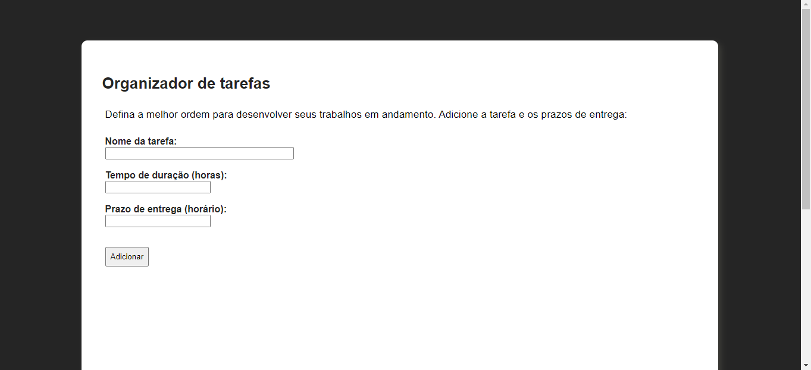

# Organized 

**Número da Lista**: 3<br>  
**Conteúdo da Disciplina**: Algoritmos Ambiciosos <br>

## Alunos

**Matrícula** | **Aluno** 
:-----------: | :---------:
16/0022673    | Ailamar Alves Guimarães
17/0080307    | Matheus Amaral Moreira

## Sobre 
Nosso projeto organiza uma lista de atividades que devem ser feitas de acordo com o prazo de entrega, devolvendo 
ao usuário a melhor ordem de execução com o mínimo de atrazo possível.

## Screenshots

- Página inicial   
<br>



## Instalação 
**Linguagem**: JavaScript <br>
**Framework**: Node JS <br>

Nosso projeto usa apenas NodeJS e um arquivo HTML como motores.

1. Abra um terminal na pasta que vai ficar os arquivos e faça o clone do repositorio do GitHub para sua máquina:
```
$ git clone https://github.com/projeto-de-algoritmos/Greed_Ailamar_Matheus.git
```

2. Segundo passo entrar na pasta do repositório e instalar as dependências do NodeJS (para isso você deve ter o NodeJS instalado):
```
$ cd ./Greed_OrganizedTasks
$ npm install
```

3. Inicie o seu servidor NodeJs com o comando:
```
$ cd ./back-end/
$ node .
```

4. Vá na pasta 'front-end' do repositório e abra o index.html

## Uso 
Escreva o nome de uma tarefa, seu prazo e tempo para ser feita e clique em adicionar.

## Outros 
Quaisquer outras informações sobre seu projeto podem ser descritas abaixo.


